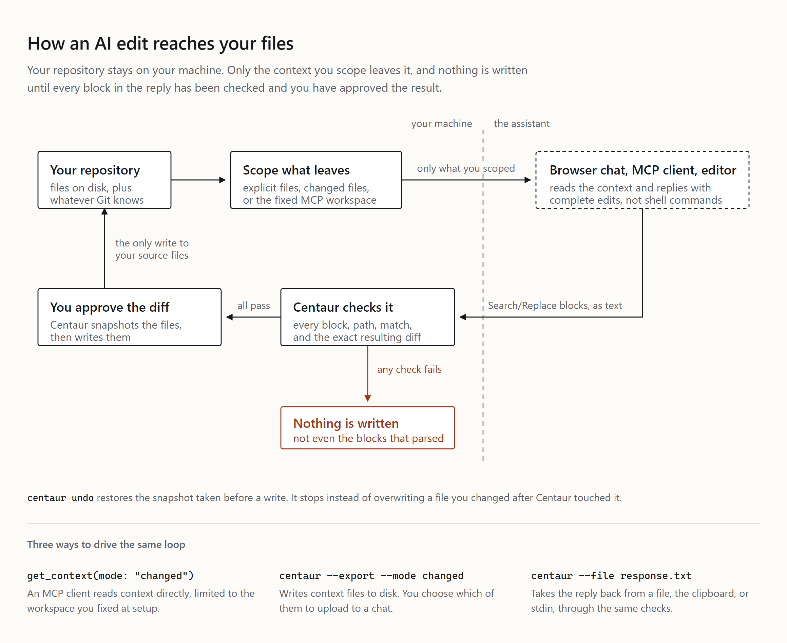
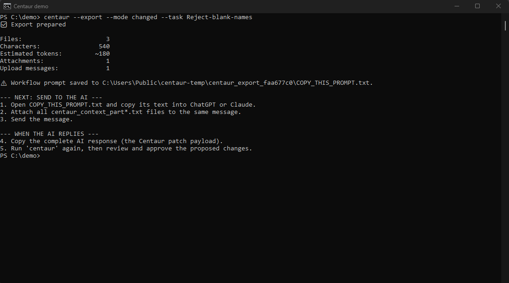
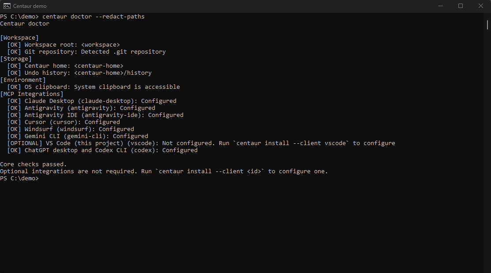
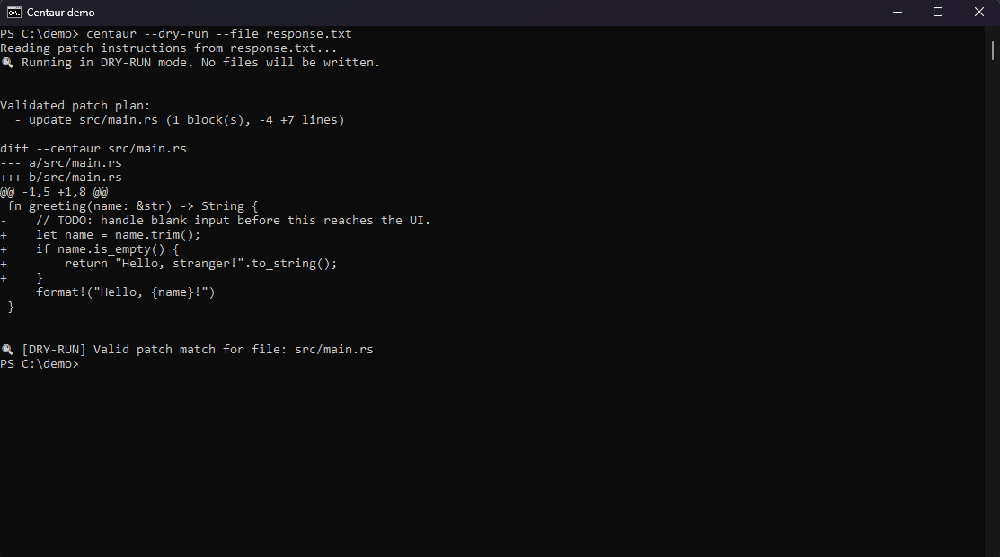
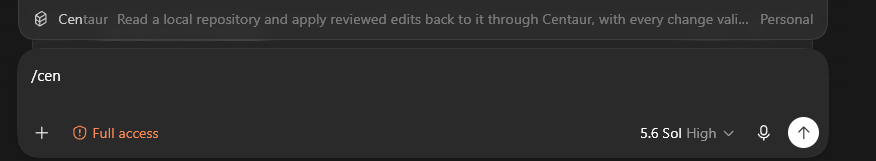
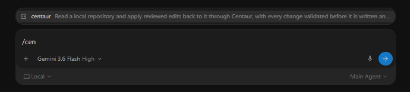
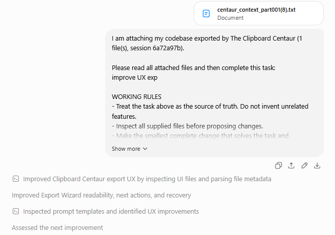
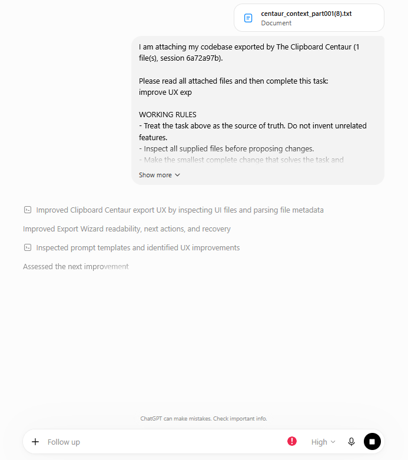
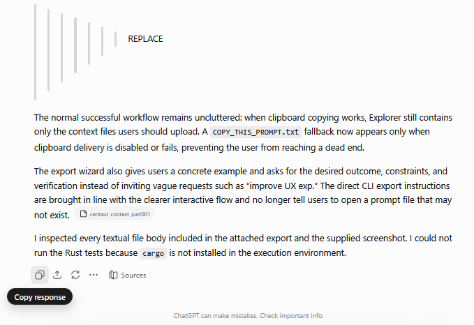

<p align="center">
  
</p>

<h1 align="center">The Clipboard Centaur</h1>

<p align="center">
  Use browser-based AI coding assistants with your local repository without giving them shell access.
</p>

## What it does

Centaur gives AI chats workspace-scoped MCP tools for reading context, applying reviewed patches, and undoing them. It also retains the file-and-clipboard workflow for clients without MCP access.

It is meant for developers who already use ChatGPT, Claude, Gemini, or another desktop or web client and do not want to give a remote model shell access. Centaur can also run as a workspace-scoped MCP server for clients that support local tools.

## Why use it?

- The model receives source files and task instructions instead of a transcript full of shell output and tool calls.
- Your shell stays local. MCP clients can access only the workspace recorded during setup; remote HTTP is loopback-only and must sit behind authenticated HTTPS.
- Centaur validates the full patch set before it writes any part of it. A missing or ambiguous Search block stops the apply.
- `centaur install` configures supported MCP clients and installs their Centaur commands or skills.
- Each successful apply records a workspace-scoped undo snapshot. Undo refuses to overwrite files changed after that patch.

## Install

Centaur requires [Rust 1.97.1 or newer](https://www.rust-lang.org/tools/install). Contributors using `rustup` automatically get the repository's tested toolchain.

```sh
cargo install --git https://github.com/DevT02/centaur.git --locked
```

To build the current checkout instead:

```sh
git clone https://github.com/DevT02/centaur.git
cd centaur
cargo install --path .
```

## Pick a workflow

| Client | Send context | Apply edits |
| --- | --- | --- |
| ChatGPT on the web | Connect the local stdio server through Secure MCP Tunnel | Call `apply_patch` or `undo` |
| Claude or Gemini on the web | Connect an authenticated HTTPS proxy to Centaur's HTTP endpoint | Call `apply_patch` or `undo` |
| Desktop app with MCP support | Call `get_context` | Call `apply_patch` or `undo` |
| VS Code | Read the active workspace | Press `Ctrl+Alt+V` or use the Centaur status-bar item |
| Terminal-based agent or editor | Run the Centaur CLI directly | Run the Centaur CLI directly |

<p align="center">
  
</p>

## What it looks like

### Export from the terminal

Run one explicit command to package changed files and print every next step. Running `centaur` with no arguments opens the interactive workspace menu for the same workflow.

<p align="center">
  
</p>

### Check setup without exposing local paths

`centaur doctor --redact-paths` checks the workspace, storage, clipboard, and optional client integrations while replacing local paths with shareable labels.

<p align="center">
  
</p>

### Review the exact patch before writing

Dry runs use the same parser and planner as a real apply, show the computed diff, and leave the workspace and undo history untouched.

<p align="center">
  
</p>


### Commands in desktop clients

`centaur install` adds `/centaur` commands to supported clients, including Antigravity, Claude, ChatGPT/Codex, Cursor, and Windsurf.

<p align="center">
  
  <br />
  <sub>Codex</sub>
</p>

<p align="center">
  
  <br />
  <sub>Antigravity</sub>
</p>

### No-copy browser workflow

ChatGPT can reach Centaur's existing stdio server through [OpenAI Secure MCP Tunnel](https://developers.openai.com/api/docs/guides/secure-mcp-tunnels). Configure the tunnel's local command as:

```sh
centaur mcp serve --workspace /absolute/path/to/project
```

Claude custom connectors and Gemini Spark custom apps accept remote MCP URLs. Start Centaur's authenticated Streamable HTTP transport locally:

```powershell
$env:CENTAUR_MCP_TOKEN = "a-random-secret-with-at-least-32-characters"
centaur mcp serve --workspace C:\absolute\path\to\project --http 127.0.0.1:3765
```

Put an OAuth-capable HTTPS tunnel or reverse proxy in front of `http://127.0.0.1:3765/mcp`, configure it to send `Authorization: Bearer <CENTAUR_MCP_TOKEN>` upstream, and add its public `/mcp` URL to the web client. Centaur refuses non-loopback HTTP bindings and unexpected browser `Origin` headers.

### Legacy browser workflow

1. Centaur copies the prompt after an export. Paste it into the chat, attach `centaur_context_part001.txt` and any additional parts, then send the message.

<p align="center">
  
</p>

2. The model reads the exported files and replies with a Centaur patch payload, or exactly `NO_CHANGES` when no file edits are needed.

<p align="center">
  
</p>

3. Once the response is complete, copy it and run `centaur --clipboard`. Centaur validates the complete payload, shows the exact computed diff, and asks whether to apply it.

<p align="center">
  
</p>


### Patch format

For a workspace with this structure:

```text
my-project/
├── src/
│   ├── main.rs       # Application entry point
│   └── auth.rs       # Authentication module
├── Cargo.toml        # Build configuration
└── .centaur/         # Isolated workspace undo snapshots
```

The model returns edits in this format:

```text
File: src/auth.rs
<<<<<<< SEARCH
pub fn init() {
    // TODO: initialize auth
}
=======
pub fn init() -> Result<()> {
    println!("Auth initialized");
    Ok(())
}
>>>>>>> REPLACE
```

## Quick start

From the repository you want the AI to edit:

### Browser chat

```sh
# 1. Export changed/untracked files plus your task.
centaur --export --mode changed --task "Add keyboard navigation to the command menu"
```

Centaur opens the export folder and copies the prompt. Paste it into the chat and attach every generated `centaur_context_part*.txt` file.

When the AI replies with a Centaur patch payload, copy the response and run:

```sh
# 2. Validate, preview, and apply the response.
centaur --clipboard

# 3. Revert the latest applied patch if needed.
centaur undo
```

For scripts, pipe one complete payload through standard input. Writes require the explicit `--yes` approval flag; omit it or use `--dry-run` to validate without writing.

```sh
generate-centaur-patch | centaur --stdin --dry-run
generate-centaur-patch | centaur --stdin --yes
```

### Desktop apps and editors

Run the setup command inside the project directory:

```sh
centaur install
```

Restart the client after setup. Clients with MCP support get the `get_context`, `apply_patch`, and `undo` tools. Supported command systems also get a `/centaur` command or skill.

## Export modes

| Mode | What it exports |
| --- | --- |
| `full` | All eligible files under the selected paths (default) |
| `changed` | Modified and untracked Git files |
| `staged` | Staged Git files |
| `compact` | Full context, replacing highly repetitive generated content with short summaries |

Pass specific files or directories after `--export` to narrow a full or compact export:

```sh
centaur --export src tests/regressions.rs --task "Fix the parser regression"
```

Before uploading sensitive code, use `--redact`. It rewrites only the temporary export copy; your workspace is untouched.

```sh
centaur --export --mode changed --redact
```

## Command reference

| Command | Action |
| --- | --- |
| `centaur install` | Configure supported MCP clients and install Centaur commands or skills |
| `centaur doctor [--redact-paths]` | Check core health and optional integrations; hide local paths for shareable output |
| `centaur update` | Reinstall the latest version from the Centaur Git repository |
| `centaur` / `centaur ui` | Open the interactive workspace terminal UI |
| `centaur --export [paths...]` | Create upload-ready context files and copy the workflow prompt |
| `centaur --clipboard` | Read, preview, and apply patch blocks from the clipboard |
| `centaur --file response.txt` | Read patch blocks from a file |
| `centaur --stdin` | Read one complete patch payload from standard input |
| `centaur --stdin --yes` | Apply piped input after validation without an interactive prompt |
| `centaur --dry-run --clipboard` | Validate and preview clipboard patches without writing |
| `centaur undo [session-id]` | Revert a patch session; defaults to the latest |
| `centaur history` | Browse patch history for the current workspace |
| `centaur audit` | Scan the workspace for likely leaked credentials |
| `centaur prompt show\|copy\|edit\|reset` | Manage the workflow prompt templates |
| `centaur config init\|path` | Create default config or print its location |
| `centaur --llm auto --clipboard --yes` | Let a local Ollama model repair unmatched blocks, then validate and apply the result transactionally |
| `centaur mcp install [--client <id>]` | Add Centaur to an MCP client configuration (`--client all` for all) |
| `centaur mcp serve --workspace <path> --http 127.0.0.1:3765` | Serve authenticated Streamable HTTP using `CENTAUR_MCP_TOKEN` |
| `centaur skill install [--client <id>]` | Install Centaur commands or skills (`--client all` for all) |

Run `centaur --help` for every option and default.

## Desktop client setup

Desktop AI applications can read and patch a repository through the Model Context Protocol and slash command skills.

After installing Centaur, run this from the repository the client should use:

```sh
centaur install
```

### Example output
```text
Setting up Centaur for workspace C:\Users\username\code\my-project...

--- MCP Configurations ---
[claude-desktop] Configured at C:\Users\username\AppData\Roaming\Claude\claude_desktop_config.json
[antigravity]      Configured at C:\Users\username\.gemini\antigravity\mcp_config.json
[cursor]           Configured at C:\Users\username\.cursor\mcp.json
[windsurf]         Configured at C:\Users\username\.codeium\windsurf\mcp_config.json
[vscode]           Configured at C:\Users\username\code\my-project\.vscode\mcp.json

--- Slash Commands & Skills ---
[antigravity] Installed C:\Users\username\.gemini\config\skills\centaur\SKILL.md
[claude]      Installed C:\Users\username\.claude\skills\centaur\SKILL.md
[chatgpt]     Installed C:\Users\username\.codex\prompts\centaur.md

Centaur setup complete. Restart your AI client(s) to activate.
```

Or target a specific client / workspace:

```sh
centaur install --client antigravity
centaur install --client claude --workspace ~/code/api --name centaur-api
```

### Supported clients

| Client ID | Application | MCP setup | Command or skill setup |
| --- | --- | --- | --- |
| `antigravity` | Antigravity | Writes `mcp_config.json` | Installs skills under `~/.gemini/config/skills/` and `.agents/skills/` |
| `claude` | Claude Desktop and Claude Code | Writes `claude_desktop_config.json` | Installs files under `~/.claude/skills/` and `~/.claude/commands/` |
| `chatgpt` | ChatGPT Desktop and Codex CLI | Prints a TOML snippet and stdio instructions | Installs prompts under `~/.codex/prompts/` and prints custom-instruction guidance |
| `cursor` | Cursor | Writes `.cursor/mcp.json` | Installs commands under `.cursor/commands/` |
| `windsurf` | Windsurf | Writes `mcp_config.json` | Installs workflows under `.windsurf/workflows/` |
| `vscode` | VS Code | Writes `.vscode/mcp.json` | Adds a workspace task |
| `agents` | Clients that use shared agent skills | Not applicable | Installs skills under `~/.agents/skills/` |

### What the model can and cannot do

It can read the workspace, apply Search/Replace blocks, and revert them.

`get_context` returns the directory map and file contents, so a client with no filesystem of its own gets the whole loop without any export or attachment step. Modes match `--export`: `full`, `changed`, `staged`, and `compact`. Large projects come back in numbered parts the model pages through, and `paths` narrows a read to part of the tree. Detected credentials are reported so you see what was sent; `redact` masks them, at the cost of Search text that no longer matches those lines.

It cannot choose the workspace: the directory recorded at install time is the only one the server will read or write, and paths that try to escape it are refused. Every apply validates all blocks before writing any of them, and records an undo snapshot first. `undo` restores the most recent session unless you name an older one.

Because the workspace is fixed at install time, a second project needs its own entry and a client restart:

```sh
centaur mcp install --client antigravity --workspace ~/code/api --name centaur-api
```

### Web clients

- ChatGPT web: use OpenAI Secure MCP Tunnel with the stdio command above. The tunnel is outbound-only, so Centaur does not need a public listener.
- Claude web: add the authenticated public `/mcp` URL under **Customize → Connectors**. [Claude's cloud must be able to reach that URL](https://support.claude.com/en/articles/11175166-get-started-with-custom-connectors-using-remote-mcp).
- Gemini web: eligible Gemini Spark users can add the same URL under **Connected Apps → Custom apps for Spark**. [Gemini custom apps require a standard MCP server URL](https://support.google.com/gemini/answer/17209137).

The HTTP server intentionally does not implement TLS or OAuth. A tunnel or reverse proxy owns that internet-facing security boundary and forwards an authenticated request to Centaur's loopback listener. Keep the clipboard workflow for accounts that do not have the required connector feature.

Editors that already run shell commands do not need any of this. They can call the CLI directly.

## Documentation

- [Usage guide](https://github.com/DevT02/centaur/blob/master/docs/USAGE.md): recipes, configuration, prompt customization, and troubleshooting
- [Architecture](https://github.com/DevT02/centaur/blob/master/docs/ARCHITECTURE.md): data flow, module map, and safety invariants
- [Contributing](https://github.com/DevT02/centaur/blob/master/CONTRIBUTING.md): setup, checks, and pull request expectations
- [Security policy](https://github.com/DevT02/centaur/blob/master/SECURITY.md): private vulnerability reporting and security scope
- [Productivity roadmap](https://github.com/DevT02/centaur/blob/master/docs/ROADMAP.md): prioritized improvements for releases, automation, and AI-assisted development

## Development

```sh
cargo fmt --all -- --check
cargo clippy --all-targets --all-features --locked -- -D warnings
cargo test --all-targets --locked
cargo run -- --help
```

## License

MIT. See [LICENSE](LICENSE).
