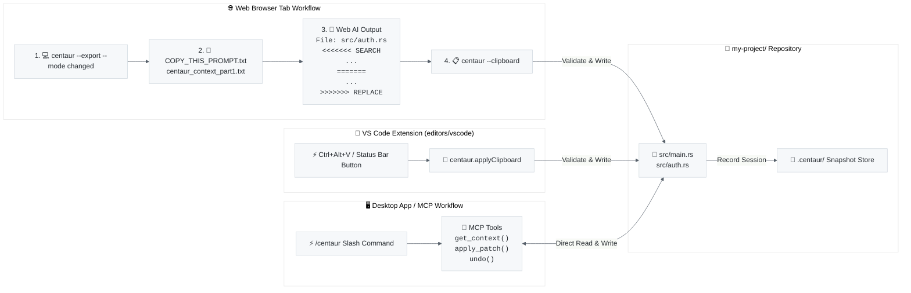
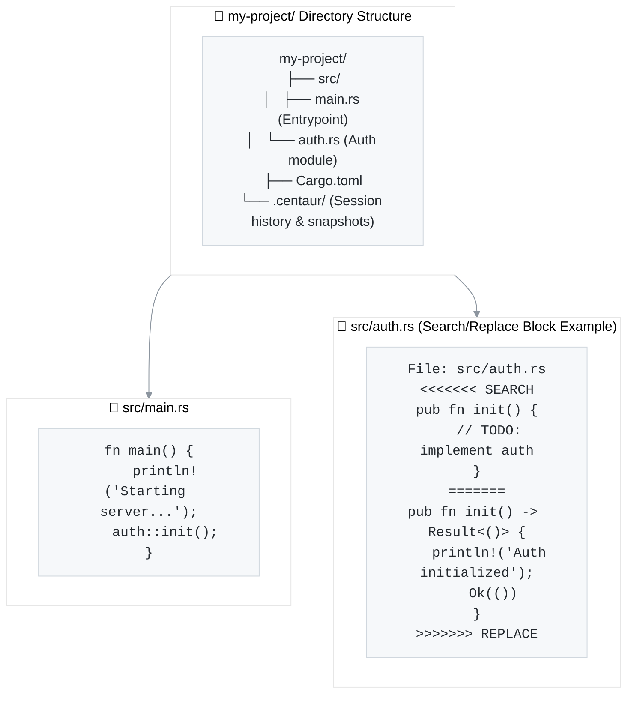

<p align="center">
  
</p>

<h1 align="center">The Clipboard Centaur</h1>

<p align="center">
  Use browser-based AI coding assistants with your local repository without giving them shell access.
</p>

## About

Centaur is a simpler way to move code from a local folder into a browser-based AI session and bring reviewed edits back. It packages the right files, copies a precise prompt, validates the response, previews every change, and keeps an undo snapshot.

Use the web AI access you already have instead of paying for an API-driven agent loop. You keep terminal access local while the model gets enough project context for implementation, review, and system-design work, not just blind vibe coding.

## Why Centaur?

- **You stay in control.** Review every affected file and line count before anything is written.
- **Your tools stay separate.** The model receives only the files you export and never gets direct terminal access.
- **Mistakes are reversible.** Each applied patch creates a local history entry that `centaur undo` can restore.
- **Exports are safer.** Centaur warns about likely credentials and can redact them from the temporary upload copy.
- **Large repositories fit.** Context is split into attachment-sized batches with a manifest and token estimate.
- **Save tokens for architecture.** Get past context limits when system planning. The model can spend its tokens making the best design decisions instead of wasting them on terminal output and tool overhead.

## Install

Centaur requires the [current stable Rust toolchain](https://www.rust-lang.org/tools/install). Contributors using `rustup` automatically get the repository's tested toolchain.

```sh
cargo install --git https://github.com/DevT02/centaur.git
```

To build the current checkout instead:

```sh
git clone https://github.com/DevT02/centaur.git
cd centaur
cargo install --path .
## Workflow Architecture



### Example Project & File Context View

Here is how Centaur inspects a project workspace (`my-project/`) and parses patch blocks back into your source code:



## Quick start

From the repository you want the AI to edit:

### Method 1: Web Browser AI (ChatGPT / Claude / Gemini Web)

```sh
# 1. Export changed/untracked files plus your task.
centaur --export --mode changed --task "Add keyboard navigation to the command menu"
```

Centaur opens the export folder and copies the workflow prompt to your clipboard. Paste that prompt into your web AI, attach the generated `centaur_context_part*.txt` files, and send the message.

When the AI replies with Search/Replace blocks, copy the response and run:

```sh
# 2. Validate, preview, and apply the response.
centaur --clipboard

# 3. Revert the latest applied patch if needed.
centaur undo
```

### Method 2: GUI AI Clients & Editors (Antigravity, Claude Desktop, ChatGPT Desktop, Cursor, Windsurf)

Run the **1-step setup command** inside your project directory:

```sh
# Auto-configures MCP servers and GUI slash commands across all supported AI clients
centaur install
```

After restarting your AI client, the `/centaur` slash command and MCP tools (`get_context`, `apply_patch`, `undo`) land automatically in your client's toolbelt.

## Export modes

| Mode | What it exports |
| --- | --- |
| `full` | All eligible files under the selected paths (default) |
| `changed` | Modified and untracked Git files |
| `staged` | Staged Git files |
| `compact` | Full context, replacing highly repetitive generated content with short summaries |

Pass specific files or directories after `--export` to narrow a full or compact export:

```sh
centaur --export src tests/regressions.rs --task "Fix the parser regression"
```

Before uploading sensitive code, use `--redact`. It rewrites only the temporary export copy; your workspace is untouched.

```sh
centaur --export --mode changed --redact
```

## Command reference

| Command | Action |
| --- | --- |
| `centaur install` | **1-Step Setup:** Auto-configure MCP servers & slash commands across all AI clients |
| `centaur doctor` | Run system diagnostics, workspace health checks & client integration status |
| `centaur` / `centaur ui` | Open the interactive workspace terminal UI |
| `centaur --export [paths...]` | Create upload-ready context files and copy the workflow prompt |
| `centaur --clipboard` | Read, preview, and apply patch blocks from the clipboard |
| `centaur --file response.txt` | Read patch blocks from a file |
| `centaur --dry-run --clipboard` | Validate and preview clipboard patches without writing |
| `centaur undo [session-id]` | Revert a patch session; defaults to the latest |
| `centaur history` | Browse patch history for the current workspace |
| `centaur audit` | Scan the workspace for likely leaked credentials |
| `centaur prompt show\|copy\|edit\|reset` | Manage the workflow prompt templates |
| `centaur config init\|path` | Create default config or print its location |
| `centaur --llm auto --clipboard` | Let a local Ollama model repair malformed patch blocks as a fallback |
| `centaur mcp install [--client <id>]` | Add Centaur to a GUI client's MCP configuration (`--client all` for all) |
| `centaur skill install [--client <id>]` | Install `/centaur` slash commands & skills across GUI clients (`--client all` for all) |

Run `centaur --help` for every option and default.

## Which workflow is yours

Centaur has one job — get a model a repository and get reviewed edits back — and three ways to do it. Pick by what your AI client can already reach.

| Your client | Use | Setup |
| --- | --- | --- |
| A browser tab (ChatGPT, Claude, Gemini on the web) | **Clipboard Workflow** | `centaur --export`, attach files, paste reply into `centaur --clipboard` |
| A desktop app or GUI client (Antigravity, Claude Desktop, Cursor, Windsurf) | **1-Step MCP & Slash Command Setup** | `centaur install` |
| Command-line agents or editors (Claude Code, Gemini CLI, Cursor, VS Code) | **Direct CLI / Skills Setup** | `centaur install` or `centaur skill install --client all` |

## GUI clients & Integrations

Desktop AI applications can read and patch a repository through the Model Context Protocol and slash command skills.

### 1. Install Centaur

```sh
cargo install --git https://github.com/DevT02/centaur.git --force
```

### 2. Run 1-Step Setup

From any repository directory:

```sh
centaur install
```

Or target a specific client / workspace:

```sh
centaur install --client antigravity
centaur install --client claude --workspace ~/code/api --name centaur-api
```

### Supported Client Matrix

| Client id | Client Application | MCP Tools (`get_context`, `apply_patch`, `undo`) | Slash Commands (`/centaur`, `/export`) |
| --- | --- | --- | --- |
| `antigravity` | Antigravity | ✅ Auto-configured (`mcp_config.json`) | ✅ Auto-installed (`~/.gemini/config/skills/` & `.agents/skills/`) |
| `claude` | Claude Desktop & Claude Code | ✅ Auto-configured (`claude_desktop_config.json`) | ✅ Auto-installed (`~/.claude/skills/` & `~/.claude/commands/`) |
| `chatgpt` | ChatGPT Desktop & Codex CLI | ✅ TOML Snippet & STDIO guide | ✅ Prompts (`~/.codex/prompts/`) & Custom Instructions |
| `cursor` | Cursor | ✅ Auto-configured (`.cursor/mcp.json`) | ✅ Auto-installed (`.cursor/commands/`) |
| `windsurf` | Windsurf | ✅ Auto-configured (`mcp_config.json`) | ✅ Auto-installed (`.windsurf/workflows/`) |
| `vscode` | VS Code | ✅ Auto-configured (`.vscode/mcp.json`) | ✅ Workspace task |
| `agents` | Cross-client shared skills | N/A | ✅ Auto-installed (`~/.agents/skills/`) |

### What the model can and cannot do

It can read the workspace, apply Search/Replace blocks, and revert them.

`get_context` returns the directory map and file contents, so a client with no filesystem of its own gets the whole loop without any export or attachment step. Modes match `--export`: `full`, `changed`, `staged`, and `compact`. Large projects come back in numbered parts the model pages through, and `paths` narrows a read to part of the tree. Detected credentials are reported so you see what was sent; `redact` masks them, at the cost of Search text that no longer matches those lines.

It cannot choose the workspace: the directory recorded at install time is the only one the server will read or write, and paths that try to escape it are refused. Every apply validates all blocks before writing any of them, and records an undo snapshot first. `undo` restores the most recent session unless you name an older one.

Because the workspace is fixed at install time, a second project needs its own entry and a client restart:

```sh
centaur mcp install --client antigravity --workspace ~/code/api --name centaur-api
```

### Clients this does not reach

ChatGPT on the web accepts only remote HTTPS servers, so a local one cannot reach it. The consumer Gemini app is the same: its MCP support runs through Google's developer tooling rather than the chat app. Use the clipboard workflow for those.

Editors that already run shell commands do not need any of this. They can call the CLI directly.

## Documentation

- [Usage guide](https://github.com/DevT02/centaur/blob/master/docs/USAGE.md): recipes, configuration, prompt customization, and troubleshooting
- [Architecture](https://github.com/DevT02/centaur/blob/master/docs/ARCHITECTURE.md): data flow, module map, and safety invariants
- [Contributing](https://github.com/DevT02/centaur/blob/master/CONTRIBUTING.md): setup, checks, and pull request expectations
- [Productivity roadmap](https://github.com/DevT02/centaur/blob/master/docs/ROADMAP.md): prioritized improvements for releases, automation, and AI-assisted development

## Development

```sh
cargo test --all-targets --locked
cargo run -- --help
```

## License

MIT
