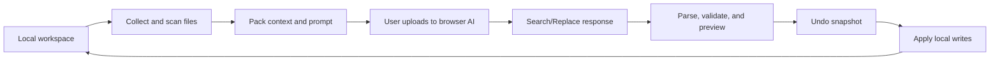

# Architecture

Centaur is a local bridge. It prepares context and prompts, but the user performs the browser upload and decides whether validated edits are applied.

## Export pipeline

1. `main.rs` or `ui.rs` selects paths, an `ExportMode`, and limits.
2. `export::collect_files` resolves full, changed, staged, or compact scope.
3. `export::scan_files` reports likely credentials; `--redact` creates sanitized temporary copies.
4. `pack::pack_files_dynamic` orders files, omits unsupported data, splits oversized context, and builds the manifest.
5. `export::run` writes a unique temporary export directory and copies the rendered prompt when configured.

`src/export.rs` is the shared implementation. Keep CLI and interactive flows routed through it so redaction, filtering, and output behavior cannot drift apart.

## Apply pipeline

1. `lib::parse_blocks` extracts and cleans Search/Replace blocks from clipboard or file input.
2. `review::summarize_patch_blocks` prepares the human review.
3. `patch::apply_blocks_transactional` validates paths and computes every resulting file in memory.
4. Any missing, ambiguous, or unsafe block aborts the plan before disk writes.
5. `history::PatchSessionRecord` stores original contents before writes begin.
6. Files are written through temporary paths. `centaur undo` restores the workspace-scoped snapshot.

## Module map

| Module | Responsibility |
| --- | --- |
| `main.rs` | Clap arguments, subcommands, process exit behavior, and CLI orchestration |
| `ui.rs` | Interactive terminal dashboard and wizards |
| `lib.rs` | Public API and tolerant response parser |
| `export.rs` | Shared export orchestration and temporary redaction copies |
| `git.rs` | Git-aware export scopes |
| `pack.rs` | Walking, prioritization, token estimates, batching, and manifest output |
| `patch.rs` | Workspace path security, matching, planning, and writes |
| `history.rs` | Persistent, workspace-scoped undo records |
| `secrets.rs` | Credential-pattern detection and redaction |
| `prompt.rs` | Default/custom prompt templates and placeholder rendering |
| `config.rs` | Persistent export settings and `CENTAUR_HOME` |
| `review.rs` | Per-file patch summaries |
| `mcp.rs` | MCP stdio server exposing apply and undo to shell-less GUI clients |

## Safety invariants

- Every target must remain under the canonical workspace root.
- New files must not escape through an existing symlinked ancestor.
- Every block must validate before any planned block is written.
- A failed undo snapshot prevents all writes.
- Dry runs must not write files or history.
- Redaction must never mutate the source workspace.
- Undo sessions must be visible only from the workspace that created them.
- The MCP workspace root comes from the launching client's configuration, never from a tool argument.
- Existing CRLF line endings and UTF-8 BOM behavior must remain stable.

Tests for these boundaries belong in `tests/regressions.rs` or `tests/intricate_edge_cases.rs`. CLI exit behavior belongs in `tests/exit_codes.rs`; Git status parsing belongs in `tests/git_changed.rs`.
